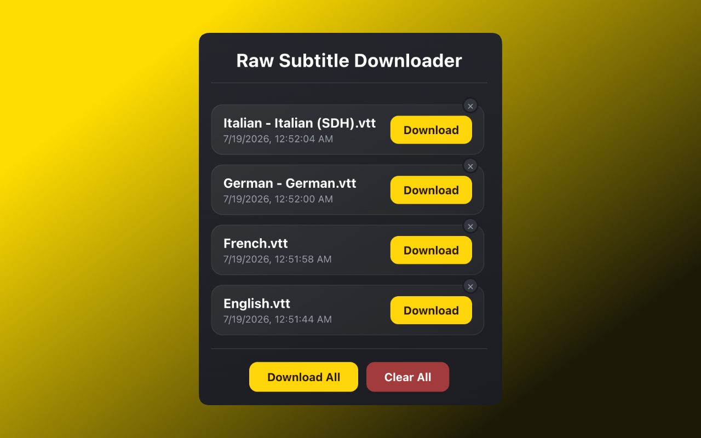

# Raw Subtitle Downloader

A Chrome extension (Manifest V3) that detects subtitle files requested by web pages and provides one-click downloads.

## Features

- Passive detection of subtitle requests via the `webRequest` API
- Per-tab tracking; entries are cleared when a tab is closed or reloaded
- Single and bulk downloads through the `downloads` API
- Per-item removal and clear-all
- Toolbar badge showing the number of detected files
- In-memory storage only; no page injection, no persistence, no external requests, no telemetry

## Installation (unpacked)

1. Clone or download this repository.
2. Open `chrome://extensions`.
3. Enable **Developer mode**.
4. Click **Load unpacked** and select the project root (the folder containing
   `manifest.json`).

## Usage

1. Open any website that streams video.
2. Play the video and/or change the subtitle track so the file loads.
3. Click the toolbar icon to see the detected subtitle files.
4. Download a single file, download them all at once, or remove the ones you don't need.

## How it works

- `src/background.js` runs as the service worker. It listens to
  `chrome.webRequest.onCompleted` for `http`/`https` responses, matches the URL path against the supported extensions,
  deduplicates by URL, and keeps each entry in memory.
- `src/popup.js` requests the current list over `chrome.runtime` messaging, renders it, and starts downloads with
  `chrome.downloads.download`.

## Permissions

- `webRequest` — read request URLs to detect subtitle files
- `downloads` — save detected files to disk
- `host_permissions` (`http://*/*`, `https://*/*`) — observe requests on any site

## File formats

`.ass`, `.cap`, `.dfxp`, `.dks`, `.idx`, `.itt`, `.jss`, `.lrc`, `.mks`, `.mpl`,
`.pjs`, `.psb`, `.qt.txt`, `.qttext`, `.rt`, `.sbv`, `.scc`, `.smi`, `.srt`,
`.ssa`, `.stl`, `.sub`, `.sup`, `.ttml`, `.ttml2`, `.usf`, `.vtt`

## Support

If this project helps you, please consider giving it a [Star ⭐️](https://github.com/mahelbir/raw-subtitle-downloader) on
GitHub. This will encourage us to continue developing and maintaining this project.

## License

The MIT License (MIT). Please see [License File](LICENSE) for more information.